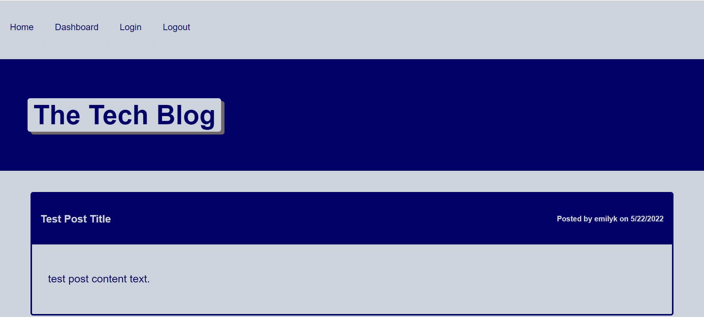
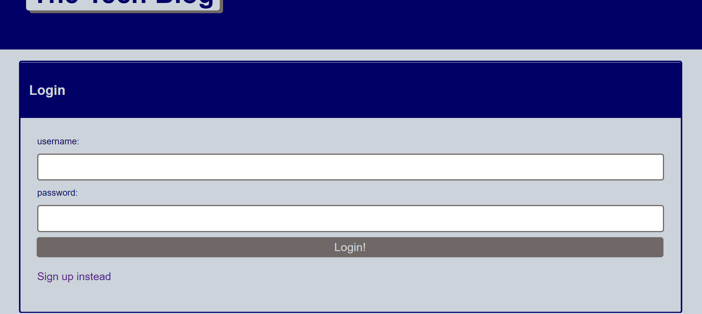
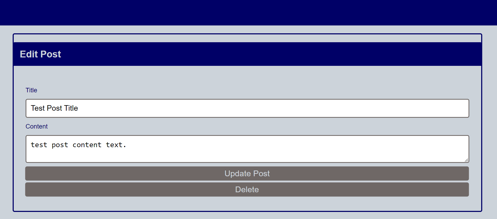

  # Tech Blog
  

  ## Description
  This full-stack application is a blog site that allows users to share blog posts and comments about posts. This project follows the MVC paradigm, using Express.js to set up the server and API controllers, MySQL2 and Sequelize to set up the models connected to a MySQL database, and Handlebars for the views. Other packages used include express-session and connect-session-sequelize to add authentication, dotenv to use environment variables, and bcrypt to hash user passwords. Through API routes that follow CRUD principles, anyone can view blog posts and comments, while logged-in users can create new posts, edit or delete their posts, and post comments on the site. This is a great site for users to share their thoughts and opinions and converse with each other about technology. In the future, I hope to add features to this blog site including admin-level users, a separate forum-style interface, and a resources page.

  ## Table of Contents
  * [Screenshots](#screenshots)
  * [Installation](#installation)
  * [Usage](#usage)
  * [License](#license)
  * [Questions](#questions)

  ## Screenshots
  
  
  
  

  ## Installation
  You can clone the code from the GitHub repository linked below.

  ## Usage
  You can use this code as a template for a blog site. It includes the models for the database, the server, and the front-end. The Tech Blog can be viewed and used at [https://young-falls-35521.herokuapp.com](https://young-falls-35521.herokuapp.com).

  ## License
  
    Copyright 2022 by emilyk221.

    Licensed under the MIT license.
    Permission is hereby granted, free of charge, to any person obtaining a copy of this software and associated documentation files (the "Software"), to deal in the Software without restriction, including without limitation the rights to use, copy, modify, merge, publish, distribute, sublicense, and/or sell copies of the Software, and to permit persons to whom the Software is furnished to do so, subject to the following conditions:
    The above copyright notice and this permission notice shall be included in all copies or substantial portions of the Software.
    
  [https://opensource.org/licenses/MIT](https://opensource.org/licenses/MIT)

  ## Questions
  Please visit my GitHub profile [here](https://github.com/emilyk221) for more information about this and other projects.
  